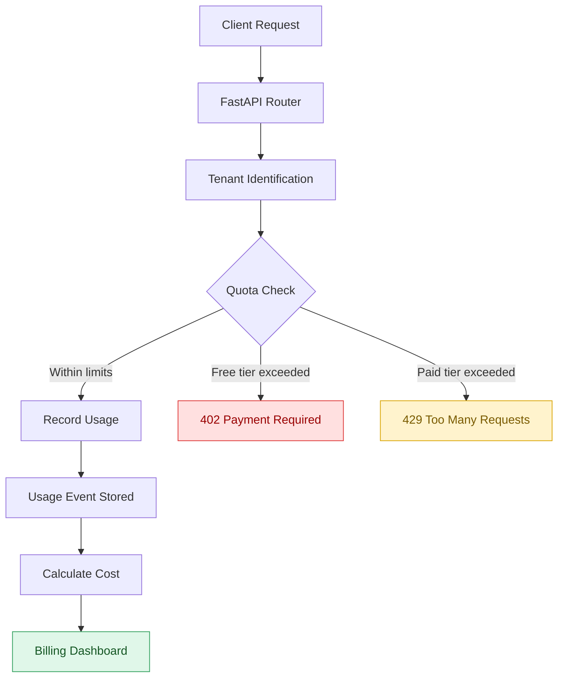
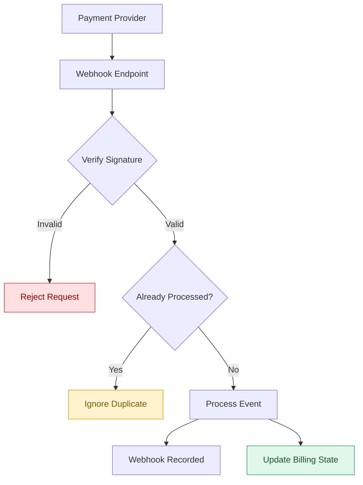
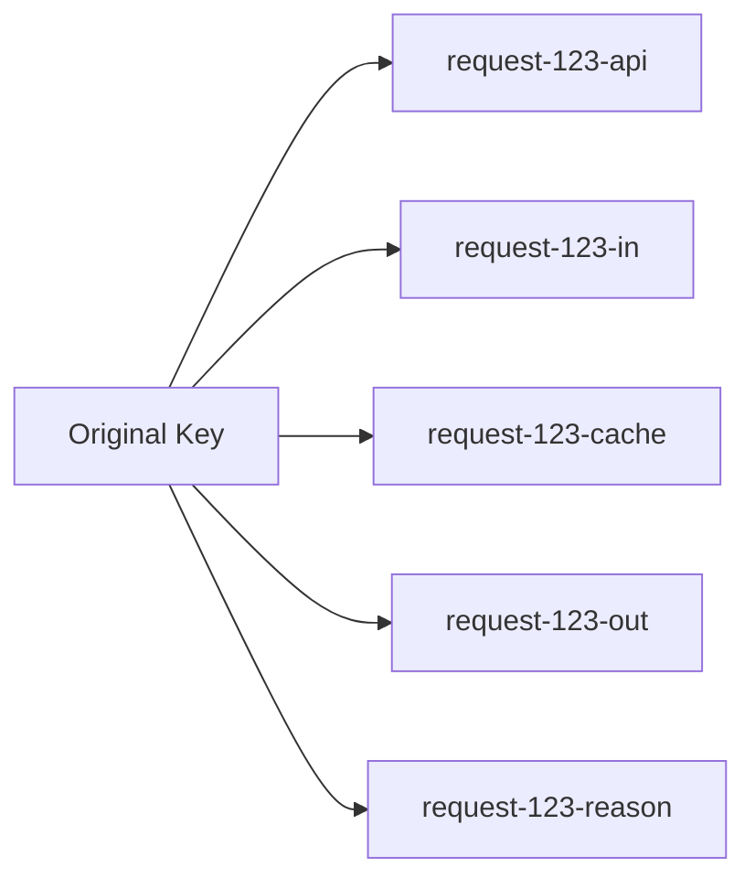

<div align="center">

# 📊 FlyRank Capstone
## Usage Metering & Billing Engine

**A production-grade, multi-tenant usage metering and billing backend for API calls and AI token consumption.**


</div>

---

## Overview

FlyRank's Capstone billing engine enforces **tenant isolation**, **exactly-once idempotent metering**, **quota limits**, **integer-precise money math**, and **cryptographically verified payment webhooks**. It's built to survive the messy realities of production billing — network retries, duplicate webhooks, and tenants trying to sneak past their quota — without ever double-charging a customer.

### ✅ Capstone Requirements at a Glance

| Requirement | Status | How it's satisfied |
|---|:---:|---|
| Exactly-once metering | ✅ | DB-level `UniqueConstraint` on `(tenant_id, idempotency_key)` |
| Multi-tenant isolation | ✅ | Enforced `X-Tenant-ID` header at the FastAPI dependency layer |
| Quota enforcement | ✅ | `402 Payment Required` (free tier) / `429 Too Many Requests` (paid tier) |
| Precise money math | ✅ | Integer micro-units — zero floating-point drift |
| Secure webhooks | ✅ | HMAC-SHA256 + `hmac.compare_digest` + replay protection |

---

## 📚 Table of Contents

- [Core Capabilities](#-core-capabilities)
- [Architecture](#️-architecture)
- [Tech Stack](#-tech-stack)
- [Project Structure](#-project-structure)
- [Getting Started](#-getting-started)
- [API Reference](#-api-reference)
- [Idempotency Design](#-idempotency-design)
- [Automated Test Suite](#-automated-test-suite)
- [Key Design Principles](#-key-design-principles)

---

## ✨ Core Capabilities

### 🔁 Idempotent Metering — Exactly-Once Guarantee

A PostgreSQL `UniqueConstraint` on `(tenant_id, idempotency_key)` in the `UsageEvent` table makes duplicate usage records impossible at the database level. `MeterService` catches the resulting `IntegrityError`, rolls back safely, and returns the *original* usage event instead of failing — so network retries or duplicate requests can never bill the same usage twice.

### 🏢 Multi-Tenant Isolation

Every tenant-specific request must carry an `X-Tenant-ID` header, validated by the `get_current_tenant` FastAPI dependency before the request ever reaches business logic. Missing or invalid tenant IDs are rejected up front, and every usage, quota, and billing calculation is scoped strictly to the authenticated tenant.

### 📊 Quota Engine & HTTP Status Codes

`QuotaService` enforces plan limits **before** any billable work is recorded:

| Scenario | Response |
|---|---|
| Free-tier limit reached | `402 Payment Required` — upgrade needed |
| Paid-tier hard limit reached | `429 Too Many Requests` — throttled |

### 💰 Money Math & AI Token Pricing

All billing math runs on **integer micro-units** — no floating-point money, ever.

| Token type | Pricing rule |
|---|---|
| Regular input tokens | Standard input-token rate |
| Cached input tokens | Discounted rate (cheaper than regular input) |
| Output tokens | Configured output-token rate |
| Reasoning tokens | Billed identically to output tokens |

Pricing rules live in a centralized config and are locked in by automated tests.

### 🔐 Payment Webhook Security

A generic `PaymentProvider` interface decouples core billing logic from any single payment vendor. The current implementation uses **Safepay Sandbox**, since Stripe does not officially support account creation in Pakistan under this project's compliance constraints.

- **Signature verification:** HMAC-SHA256 via `hmac.compare_digest` (constant-time comparison)
- **Replay protection:** `ProcessedWebhook` table blocks reprocessing of the same event
- **Retry safety:** Provider retries are absorbed idempotently

---

## 🏗️ Architecture

### Request & Billing Flow



*Headers carried on the request: `X-Tenant-ID`, `Idempotency-Key`*

### Payment Webhook Flow



*Endpoint: `POST /webhooks/safepay` · Signature check: HMAC-SHA256 via `hmac.compare_digest`*

---

## 🧰 Tech Stack

| Layer | Technology |
|---|---|
| Framework | FastAPI |
| Language | Python |
| Database | PostgreSQL |
| Database Runtime | Docker / Docker Compose |
| ORM | SQLAlchemy 2.0 |
| Migrations | Alembic |
| Testing | Pytest + HTTPX |
| Configuration | Pydantic Settings |

---

## 📁 Project Structure

```text
.
├── app/
│   ├── main.py
│   ├── database.py
│   ├── models.py
│   ├── schemas.py
│   ├── config.py
│   ├── pricing.py
│   ├── dependencies.py
│   ├── services.py
│   └── payment_provider.py
│
├── scripts/
│   └── seed.py
│
├── tests/
│   ├── test_tenant.py
│   ├── test_metering.py
│   ├── test_quotas.py
│   ├── test_cost.py
│   └── test_webhooks.py
│
├── alembic/
├── Dockerfile
├── docker-compose.yml
├── requirements.txt
└── README.md
```

---

## 🚀 Getting Started

### 1. Clone the repository

Clone the repository and move into the project directory, then create a `.env` file in the project root:

```env
POSTGRES_USER=postgres
POSTGRES_PASSWORD=postgres
POSTGRES_DB=billing_db
WEBHOOK_SECRET=whsec_test_secret_for_local_dev
```

> ⚠️ **Security:** Never commit the real `.env` file or production webhook secrets to Git.

### 2. Start PostgreSQL with Docker

```bash
docker compose up -d
```

This starts the PostgreSQL database in the background.

### 3. Create and activate a virtual environment

```bash
python -m venv .venv
source .venv/bin/activate      # Windows: .venv\Scripts\activate
```

Install dependencies:

```bash
pip install -r requirements.txt
```

### 4. Run database migrations

```bash
alembic upgrade head
```

### 5. Seed demo data

```bash
python scripts/seed.py
```

This populates a **Free Plan**, **Pro Plan**, and a **Demo Tenant** (ID `1`).

### 6. Start the API server

```bash
uvicorn app.main:app --reload
```

| Resource | URL |
|---|---|
| API root | `http://127.0.0.1:8000` |
| Interactive docs (Swagger) | `http://127.0.0.1:8000/docs` |

---

## 🔌 API Reference

| Method | Endpoint | Description |
|---|---|---|
| `GET` | `/health` | Health check for the billing engine |
| `GET` | `/me` | Returns info about the current tenant |
| `POST` | `/generate` | Simulated billable AI request |
| `GET` | `/usage` | Tenant usage dashboard |
| `POST` | `/webhooks/safepay` | Payment-provider webhook receiver |

<details>
<summary><strong>GET /health</strong></summary>

**Response**

```json
{
  "status": "ok",
  "message": "Billing engine is running"
}
```

</details>

<details>
<summary><strong>GET /me</strong></summary>

**Required header**

```text
X-Tenant-ID: 1
```

**Response**

```json
{
  "tenant_id": 1,
  "tenant_name": "Demo Tenant",
  "plan": "Free"
}
```

</details>

<details>
<summary><strong>POST /generate</strong></summary>

A dummy billable endpoint simulating an AI model request. It identifies the tenant, calculates total AI token usage, checks API-call and token quotas, records usage idempotently, calculates cost, and returns the recorded usage.

**Required headers**

```text
X-Tenant-ID: 1
Idempotency-Key: unique-request-key
```

**Request body**

```json
{
  "input_tokens": 100,
  "cached_input_tokens": 0,
  "output_tokens": 50,
  "reasoning_tokens": 0
}
```

**Response**

```json
{
  "status": "success",
  "message": "AI content generated successfully.",
  "usage_recorded": {
    "api_calls": 1,
    "total_ai_tokens": 150
  }
}
```

</details>

<details>
<summary><strong>GET /usage</strong></summary>

**Required header**

```text
X-Tenant-ID: 1
```

Returns monthly API usage, AI token usage, plan limits, remaining quota, and calculated costs.

</details>

<details>
<summary><strong>POST /webhooks/safepay</strong></summary>

Receives payment-provider webhook events: verifies the signature, rejects forged requests, checks for duplicate processing, applies valid payment/subscription events, updates tenant billing state, and records the webhook as processed.

**Required header**

```text
X-Sfp-Signature: <signature>
```

Duplicate webhook events are safely ignored to prevent duplicate subscription updates.

</details>

---

## 🔑 Idempotency Design

A single AI request can produce multiple usage events. Rather than one lump `idempotency_key`, the original key is fanned out into per-category event keys — so each usage type is stored independently while still guaranteeing exactly-once behavior *per billable event*.



*Original key: `request-123`*

---

## 🧪 Automated Test Suite

```bash
pytest -v
```

| Test file | Verifies |
|---|---|
| `test_tenant.py` | Tenant isolation, required `X-Tenant-ID` header, invalid-tenant rejection, cross-tenant data protection |
| `test_metering.py` | Correct usage recording, DB uniqueness constraints, no duplicate charges on repeated keys, safe return of original events |
| `test_quotas.py` | Usage reaching exact plan limits, rejection beyond limits, `402` for free tier, `429` for paid tier |
| `test_cost.py` | Exact AI token pricing, cached-token discount, reasoning-token parity with output tokens, integer micro-unit output |
| `test_webhooks.py` | Valid signature acceptance, forged-signature rejection, correct DB updates, duplicate/replay protection |

---

## 🧭 Key Design Principles

| Principle | Principle |
|---|---|
| 🔒 Tenant isolation at the API boundary | 🧮 Integer-based money calculations |
| 🗄️ Database-enforced uniqueness | ⚙️ Centralized pricing configuration |
| 🔁 Idempotent billing operations | 🔌 Provider abstraction |
| 🚦 Quota validation before billable work | 🔐 Cryptographic webhook verification |
| 🛡️ Webhook replay protection | ✅ Automated acceptance testing |

The result is a billing engine that separates **authorization, usage metering, cost calculation, and payment processing** into clear responsibilities — while staying extensible for additional payment providers.

